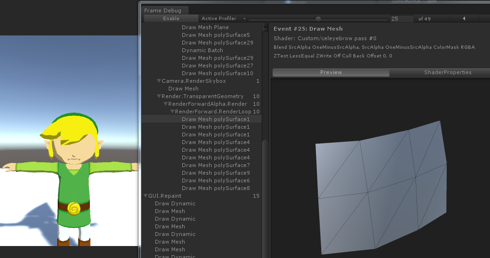
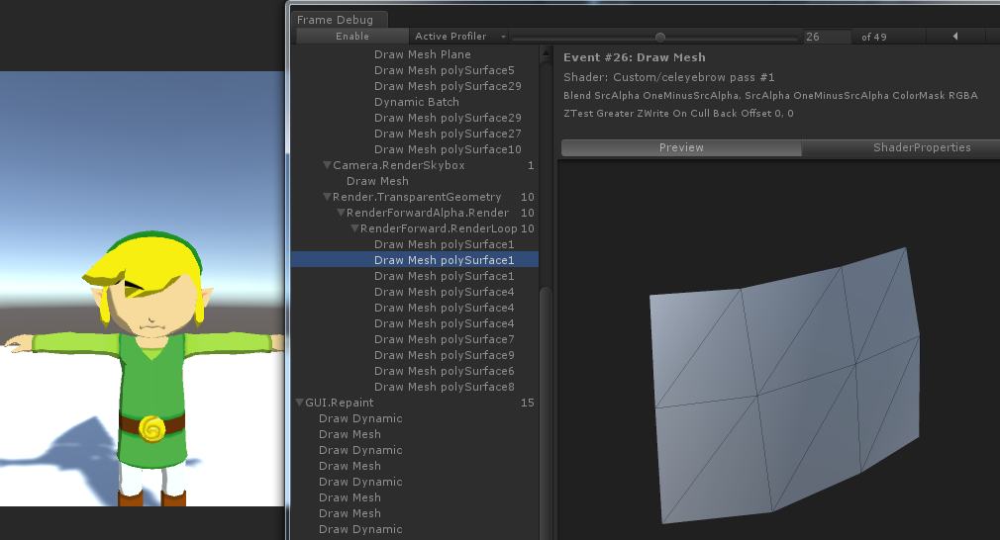
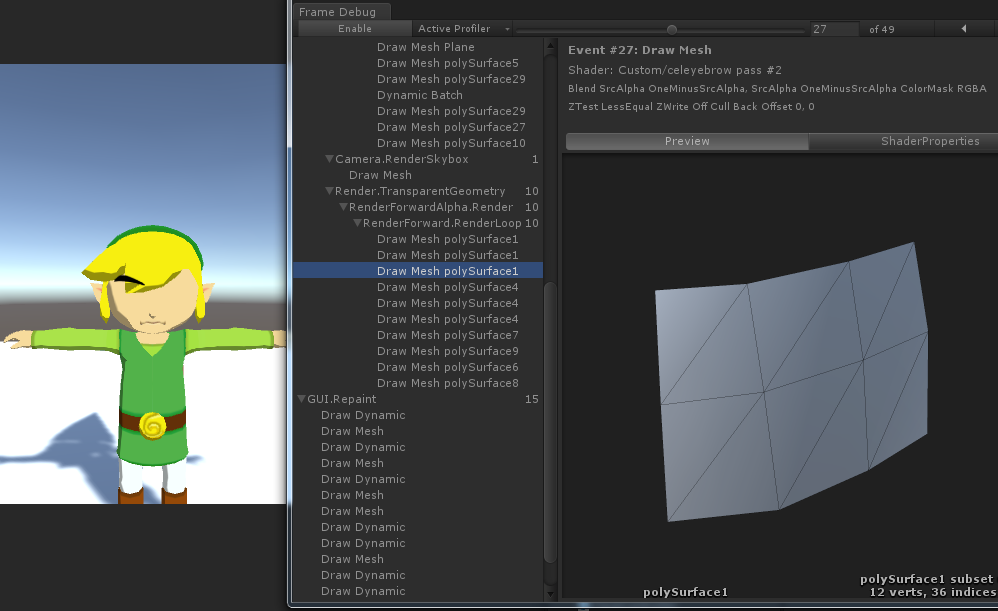

# LinkModel
GameCube Zelda Link Render

参考:拳四郎知乎上的文章进行实现https://zhuanlan.zhihu.com/p/26140321

这篇文章最难理解的是关于link眉毛的渲染的前两个Pass
第一个Pass时将所有Stencil为1且ZFail的像素Stencil改为2
第一个Pass截图如下

第二个Pass是将所有ZTest Greater并且Stencil等于2的像素绘制，被头发挡住的眉毛会被绘制出来
第二个Pass截图如下

第三个Pass是将眉毛正常渲染一遍，没被头发挡住的眉毛会被绘制出来
第三个Pass截图如下

Unity5.4.4f1工程
